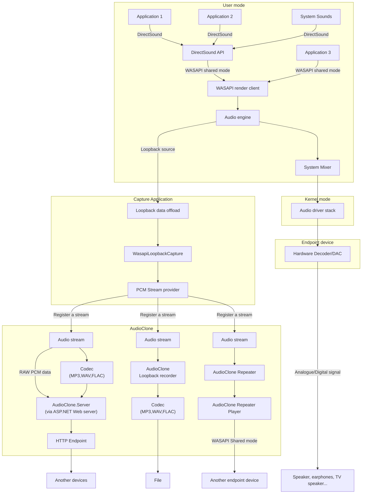

# AudioClone - 强大的音频捕获、重复和串流工具 A powerful Audio Capturing, Repeating and Streaming Utility 
AudioClone是一个强大的音频捕获、重复和串流工具，它还是AudioClone等软件的重要组件。

# AudioClone 是如何工作的
下面是一个简化的工作流程。

请注意`AudioClone`功能目前完全尚未实现，会在后续的版本中完善。

# 许可证

基于[Apache License](LICENSE.txt)开源